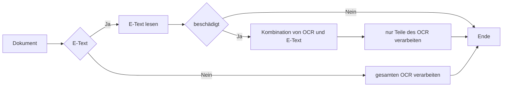

Um den Unterschied zwischen E-Text und Nicht E-Text Dokumenten zu erkennen und zu verstehen, hier eine kurze Erklärung:

## **E-Text Dokumente**

Alle E-Text Dokumente sind bereits OCR-verarbeitet. Sie können diese Dokumente erkennen, wenn Sie die PDF-Datei öffnen, den gesamten Text markieren und diesen in ein Word-Dokument kopieren können.

## **Dokumente ohne E-Text**

Dokumente, die keinen E-Text enthalten, sind nicht bearbeitbar und lassen sich leicht daran erkennen, dass die Seite nach einem Doppelklick vollständig hervorgehoben wird.

In den OCR-Einstellungen finden Sie die Option **E-Text verwenden falls verfügbar**, die durch setzen oder entfernen den Hakens im Kontrollkösten aktiviert oder deaktiviert werden kann.

:fontawesome-solid-triangle-exclamation:{ style="color: #EE0F0F" }
Mit dieser Option werden Dokumente die E-Text beinhalten nicht noch einmal vom OCR verarbeitet.

Um zu sehen welche Schritte wir durchgeführt haben und wie das Dokument verarbeitet wurde, öffnen Sie die folgende [Aktion](/_images/docbits/dokumentenvalidierung/Aktionen_dokument-flow_ansehen.png).