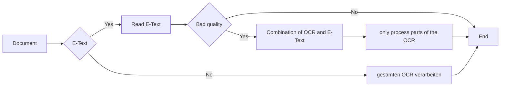

This feature allows you to recognize and understand the difference between e-text and non-e-text documents, here is a brief explanation:

## E-Text Documents

All e-text documents are already OCR-processed. You can recognize these documents if you can open the PDF file, highlight all the text, and copy it into a Word document.

## Documents without E-Text¶

Documents that do not contain e-text are non-editable and can be easily recognized by the fact that the page is fully highlighted after double-clicking.

<!--  -->

In the OCR settings you will find the Use e-text if available option , which can be enabled or disabled by ticking or unchecking the control box.

:fontawesome-solid-triangle-exclamation:{ style="color: #EE0F0F" }
With this option, documents that contain e-text are not processed again by the OCR.

To see what steps we have taken and how the document has been processed, open the following [action](/_images/docbits/Document Validation/5 - E-Text/image_4_dashboard_action.gif).